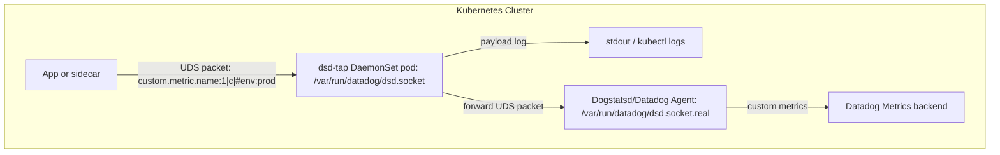

# Description
Dogstatsd TAP for UDS, to log the custom metrics for a long time period, when activating agent trace log level is not an option.

Note that by enabling Datadog agent trace log level, this information will also be retrieved ([source](https://github.com/DataDog/datadog-agent/blob/12d4b3eacc7c4156c3c0bc769d2cdc241d4b964c/comp/dogstatsd/server/server.go#L729)) in agent.log

Provided a [datadog-values.yaml](https://github.com/ddalexvea/dsd-tap/blob/main/datadog-values.yaml) for sandbox

Features:
- The dogstatsd pods are not monitored thank to this annotation `ad.datadoghq.com/metrics_exclude: "true"`
- The script stdouts the logs, so if your pod agents collect all containers logs, it will generate logs with service tag and value `dsd-tap` in Datadog UI.

### Schema



## How to implement
Prerequisite:

- Change the default UDS socket of Dogstatsd. Example via helm chart:
  ````
  datadog:
    dogstatsd:
      socketPath: /var/run/datadog/dsd.socket.real
  ````
  In application side, leave the default UDS socket to `/var/run/datadog/dsd.socket`
  
1)Download the kubernetes manifest [dsd-tap.yaml](https://github.com/ddalexvea/dsd-tap/blob/main/dsd-tap.yaml)

2)Apply the kubernetes manifest:
````
kubectl apply -f dsd-tap.yaml
````
Expected output:
````
configmap/dsd-tap-script created
daemonset.apps/dsd-tap created
````
3)Verify that the pods are running:
````
kubectl get pods -A | grep dsd-tap
````
Expected output:
````
default       dsd-tap-nlrjs                                  1/1     Running   0               28s
````
4)Verify that the pod logs:
````
kubectl logs $(kubectl get pod -l app=dsd-tap -o jsonpath='{.items[0].metadata.name}')
````
Expected output:
````
[2025-08-14T07:26:15Z] TAP started /host-datadog/dsd.socket -> /host-datadog/dsd.socket.real
````
5)From the node host, send a custom metric via UDS to /var/run/datadog/dsd.socket
````
echo -n "custom.metric.name:2|c" | nc -U -u -w1 /var/run/datadog/dsd.socket
echo -n "custom.metric.name:1|c" | nc -U -u -w1 /var/run/datadog/dsd.socket
````
6)Verify again the pod logs:
````
kubectl logs $(kubectl get pod -l app=dsd-tap -o jsonpath='{.items[0].metadata.name}')
````
Expected output:
````
kubectl logs $(kubectl get pod -l app=dsd-tap -o jsonpath='{.items[0].metadata.name}')
[2025-08-14T07:26:15Z] TAP started /host-datadog/dsd.socket -> /host-datadog/dsd.socket.real
[2025-08-14T07:30:03Z] bytes=22 payload="custom.metric.name:2|c"
[2025-08-14T07:30:13Z] bytes=22 payload="custom.metric.name:1|c"
````
7)Verify in Datadog UI that the log appears by filtering with `service:dsd-tap`

8)Verify in Datadog UI that the custom metrics appears:


### How to delete the DaemonSet and ConfigMap
````
kubectl delete daemonset dsd-tap -n default
kubectl delete configmap dsd-tap-script -n default
````

### Documentation regarding Dogstatsd over UDS:

https://docs.datadoghq.com/developers/dogstatsd/unix_socket/?tab=host
